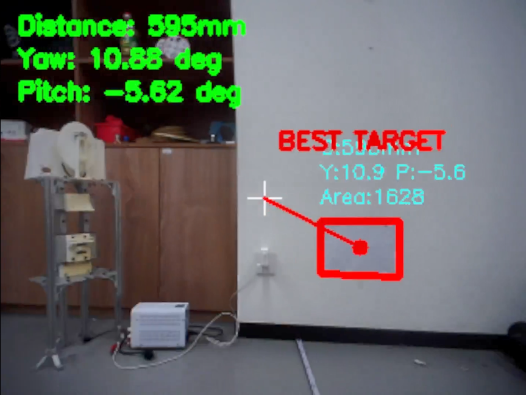
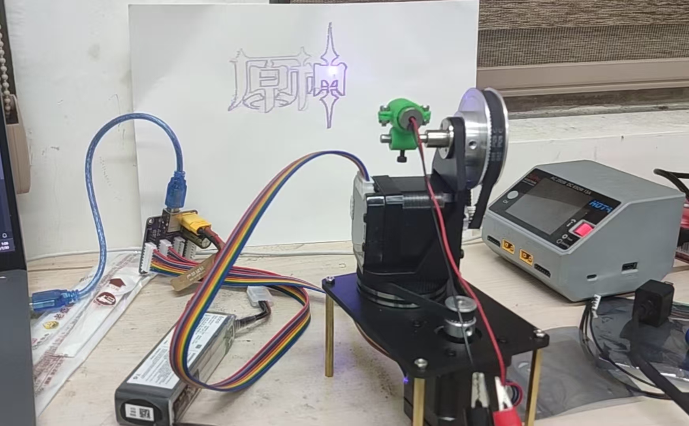

# 2025 TI杯 E题｜云台视觉跟踪方案



## 1. 系统概述

本项目面向 TI 杯 E 题视觉跟踪场景，采用“嵌入式控制 + 视觉闭环”的一体化方案：

- **主控平台**：Raspberry Pi 4B（树莓派 4B）
- **云台执行机构**：双轴结构，使用 **2 个张大头闭环 42 步进电机**
- **传动结构**：双轴 **4:1 同步带轮减速**（提升分辨率与稳定性）
- **人机交互**：4×4 矩阵按键
	- 外圈 12 个按键：用于方向/视角快速选择
	- 中间 4 个按键：用于赛题功能触发、调试功能、激光开关等

控制逻辑上，按键触发云台预置位或功能回调，视觉环路计算偏差角后驱动双轴步进修正，目标居中后执行激光动作。

---

## 2. 硬件接线说明

项目中接线定义可参考 [key_uart_led.py](key_uart_led.py) 与 [key_array.py](key_array.py)。

### 2.1 LED + 独立按键 + 串口（`key_uart_led.py`）

| 功能 | BCM引脚/设备 | 说明 |
|---|---|---|
| 激光/LED 控制 | GPIO17 | 输出，高电平点亮 |
| KEY1 | GPIO5 | 上拉输入，下降沿触发 |
| KEY2 | GPIO6 | 上拉输入，下降沿触发 |
| 电机串口 | `/dev/ttyUSB0` | 115200 波特率 |

`key_uart_led.py` 的流程为：KEY1 触发回零指令与状态确认，通过后点亮激光；KEY2 直接熄灭激光。

### 2.2 4×4 矩阵按键（`key_array.py`）

矩阵按键采用 8 根 GPIO：

- **行引脚**：GPIO18、23、24、25（输出）
- **列引脚**：GPIO12、16、20、21（输入上拉）

程序通过逐行拉低扫描列输入，带 50ms 消抖逻辑，按键触发后执行映射回调（预置方位、赛题流程、调试、关激光等）。

---

## 3. 视觉算法流程（`cv.py` 中 `cv_loop`）

视觉主流程是“检测矩形目标 → 估距 → 解算角度 → 云台修正 → 命中判定”的闭环控制。

### 3.1 图像预处理

1. 缩放
2. 灰度化 + 高斯滤波
3. 自适应阈值分割（二值化）
4. 提取外轮廓

### 3.2 候选目标筛选

对轮廓依次执行：

- 面积阈值过滤（去噪）
- 多边形逼近（保留 4 边形）
- 凸性判断 + 凸包面积比过滤（提升几何可信度）

### 3.3 中心、距离与角度计算

- **中心点**：优先使用四边形对角线交点法估计目标中心
- **距离估计**：基于两组平行边像素长度，结合目标真实尺寸与视场角，按相似几何计算距离
- **角度解算**：将像素偏差转换为 yaw / pitch 偏差，并乘以增益系数
- **误差补偿**：按距离区间对中心点作经验修正（主要是 y 向修正）

### 3.4 目标选择与控制输出

- 评分策略：综合考虑目标面积与离图像中心距离
- 选择最佳目标后输出 `yaw/pitch`，调用云台运动接口执行修正
- 若像素误差落入容差阈值，则判定对准并点亮激光

该流程在比赛场景下兼顾了识别稳定性与闭环响应速度。
由于角度近似关系，大角度偏差需修正两次，小角度一次到位

---

## 4. 效果展示

### 4.1 云台结构



### 4.2 鲁棒性


---

## 5. 项目结构与文件说明

```text
.
├── README.md
├── cv.py
├── key_array.py
├── key_callbacks.py
├── key_uart_led.py
├── lazer.py
├── zdt.py
├── image/
│   ├── main.png
│   ├── launch.jpg
│   └── robust.gif
├── stl/
│   ├── 带轮.stl
│   ├── 底板.stl
│   ├── 激光笔支架.stl
│   ├── 激光笔支架盖子.stl
│   ├── 转台.stl
│   └── 转接板.stl
└── test/
		├── a.ipynb
		├── cv.ipynb
		└── led_keys.py
```

### 文件职责说明

- `cv.py`：视觉检测与跟踪主循环（目标检测、估距、角度计算、闭环控制）
- `zdt.py`：张大头闭环步进电机串口协议封装与运动控制
- `lazer.py`：激光 GPIO 控制封装
- `key_array.py`：4×4 矩阵按键扫描、消抖与功能映射入口（主启动脚本）
- `key_callbacks.py`：按键回调函数集合（预置位、赛题动作、调试流程）
- `key_uart_led.py`：独立按键 + 串口状态确认 + 激光开关的接线与流程示例
- `image/`：README 展示图与动态效果图
- `stl/`：云台机械结构模型文件（3D 打印/结构复现）
- `test/`：项目早期验证脚本与实验 Notebook

---

## 6. 使用方式（开机自启动）

建议通过 `systemd` 将 `key_array.py` 配置为开机自动启动。

### 6.1 服务文件示例

在 `/etc/systemd/system/ti_gimbal.service` 新建：

```ini
[Unit]
Description=TI Cup Gimbal Vision Service
After=network.target

[Service]
Type=simple
User=pi
WorkingDirectory=/home/pi/2025TI杯-E题-云台视觉跟踪
ExecStart=/usr/bin/python3 /home/pi/2025TI杯-E题-云台视觉跟踪/key_array.py
Restart=always
RestartSec=2

[Install]
WantedBy=multi-user.target
```

> 若实际用户名、路径、Python 解释器路径不同，请按部署环境修改。

### 6.2 启用与验证

```bash
sudo systemctl daemon-reload
sudo systemctl enable ti_gimbal.service
sudo systemctl start ti_gimbal.service
sudo systemctl status ti_gimbal.service
```

### 6.3 常用维护命令

```bash
sudo systemctl restart ti_gimbal.service
sudo journalctl -u ti_gimbal.service -f
```

---

## 7. 说明

测评当天轮子电机故障，循线分没拿到，云台相关的分都拿了  
最终遗憾省二  

